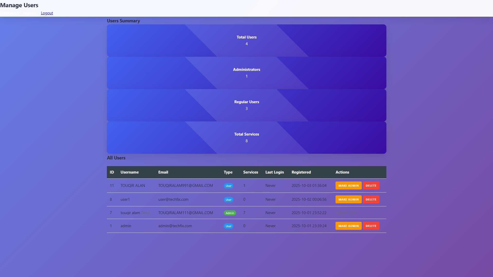
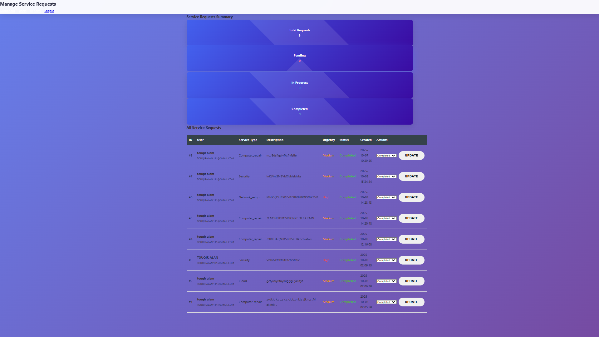
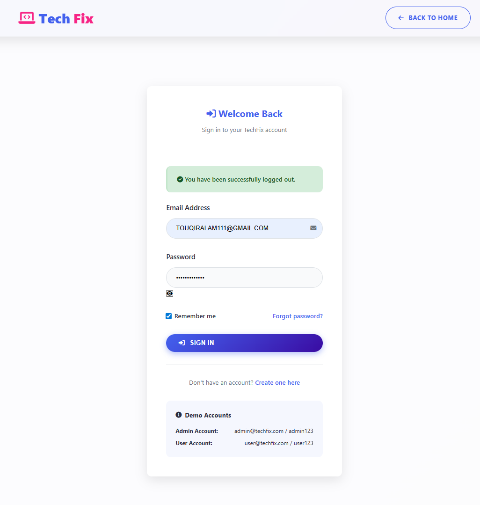
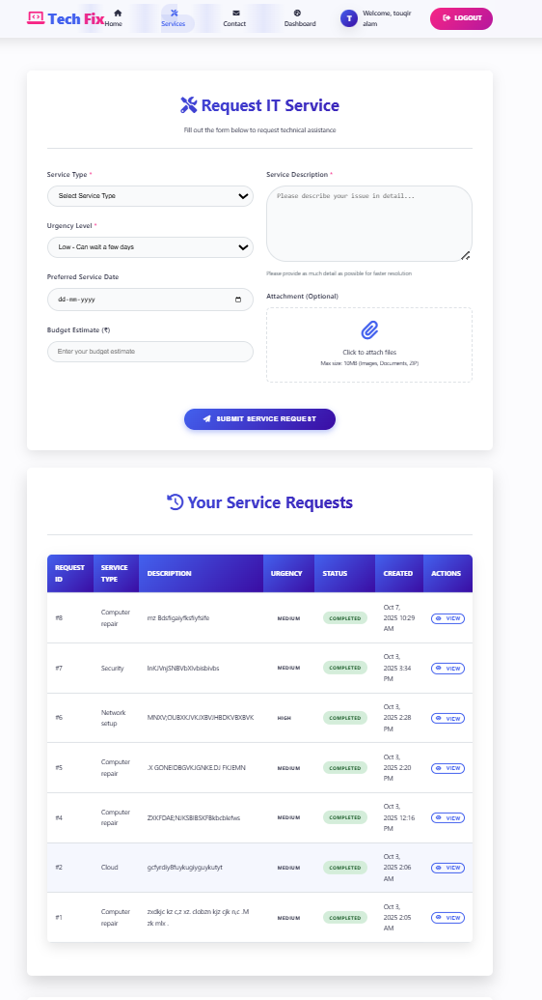
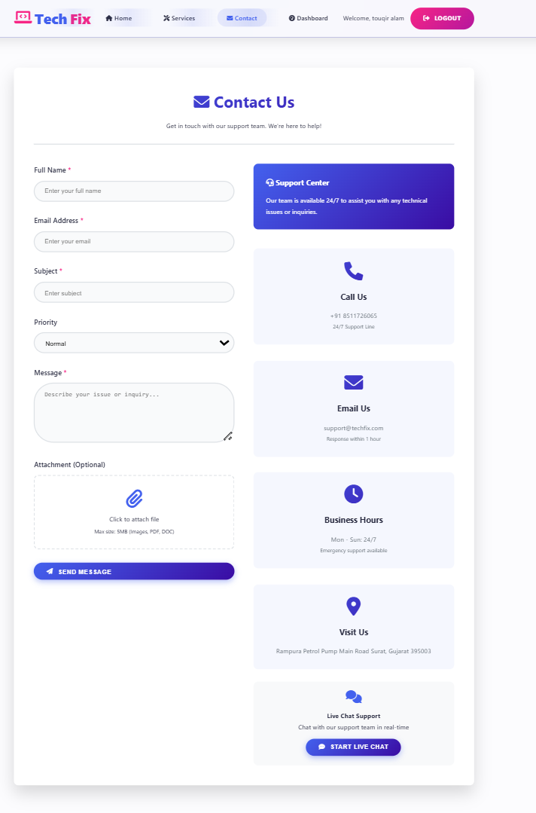

# Tech_Fix.
💻 Tech_Fix
> A Full Stack Laptop Service Management System built using PHP & MySQL.

📌 Project Overview

Tech_Fix is a full-stack web application designed to manage laptop service requests efficiently. It allows users to submit repair/service requests while providing an admin panel to manage users, services, and reports.
This project was developed to gain practical experience in full-stack web development, including frontend design, backend logic, and database integration using XAMPP.

🚀 Technologies Used
Frontend
HTML5
CSS3
JavaScript
Backend
PHP
Database
MySQL
Server
XAMPP (Apache + MySQL)
Tools & Learning Support
Git & GitHub
AI-assisted learning (DeepSeek)

✨ Features
🔐 User Registration & Login Authentication
🧑‍💼 Admin Dashboard
🛠️ Laptop Service Request System
👥 User Management (Admin Control)
📊 Reports & Service Tracking
📧 Email Functionality
🗄️ MySQL Database Integration
🔒 Secure Login System
🧩 Organized Project Structure

📂 Project Structure
Tech_Fix/
│── admin_dashboard.php
│── login.php
│── register.php
│── index.php
│── config.php
│── manage_users.php
│── manage_services.php
│── service_request.php
│── reports.php
│── send_email.php
│── cssstyle.css
│── js_script.js
│── uploads/
│── README.md

## 📸 Screenshots

⚙️ Installation & Setup
Install XAMPP
Clone this repository
git clone https://github.com/touqiralam111-eng/LAPTOP-FIXPRO
Move project folder to:
C:\xampp\htdocs\
Start Apache and MySQL in XAMPP
Create a database in phpMyAdmin
Import the provided SQL file 

Open in browser:
http://localhost/TechFix

🎯 Learning Outcomes
Through this project, I gained hands-on experience in:
Full Stack Web Development
PHP & MySQL Integration
Authentication System
CRUD Operations
Debugging & Error Handling
Real-world Project Development
Using AI tools to improve coding and understanding

🔮 Future Improvements
Responsive UI Design
Password Encryption & Security Enhancement
Online Hosting (Live Deployment)
REST API Integration
Modern Frontend (Angular / React)
MongoDB & Node.js Version

## 🌐 Live Demo
Coming Soon...

👨‍💻 Author
Touqir Alam
🎓 B.Tech (6th Semester)  
💻 Aspiring Full Stack Developer  
🚀 Passionate about Web Technologies

GitHub:
👉 https://github.com/touqiralam111-eng

⭐ Support
If you like this project, please star ⭐ the repository and share your feedback.
